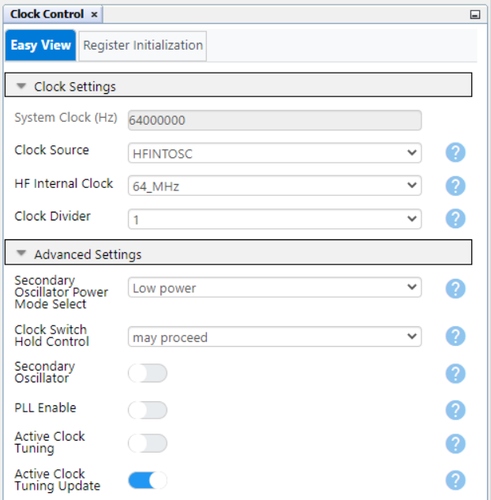
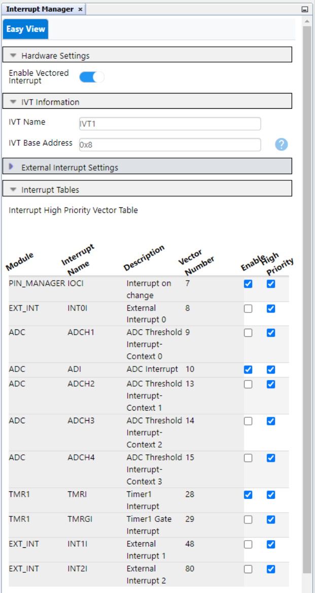
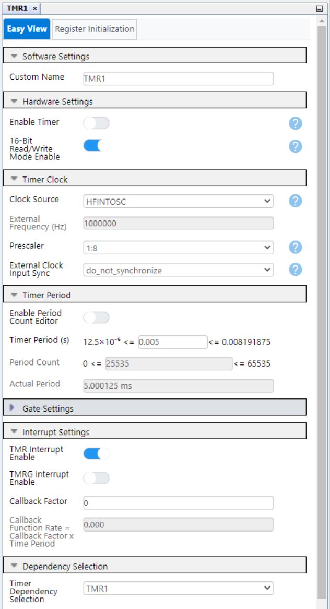
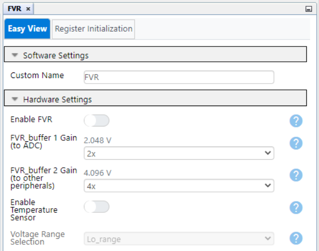
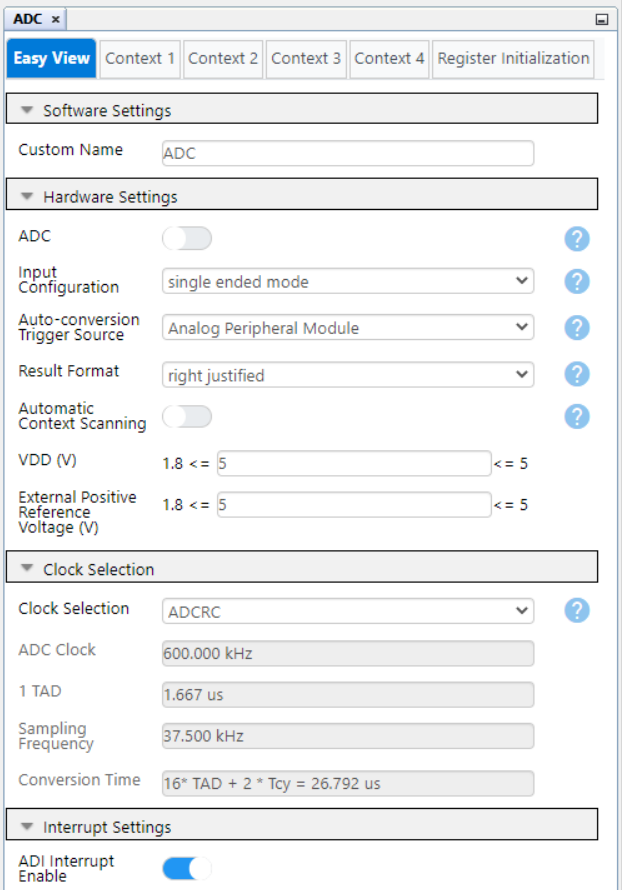
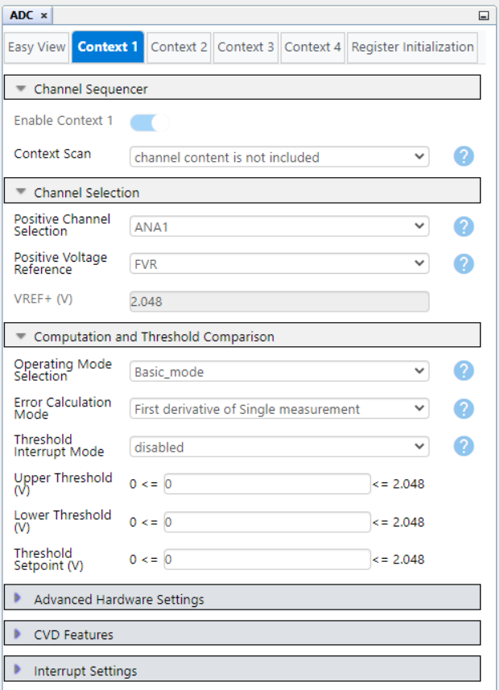
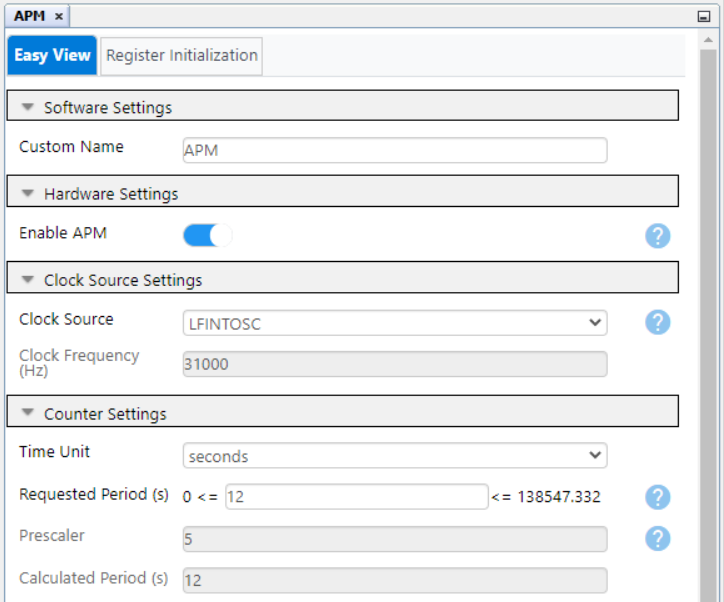
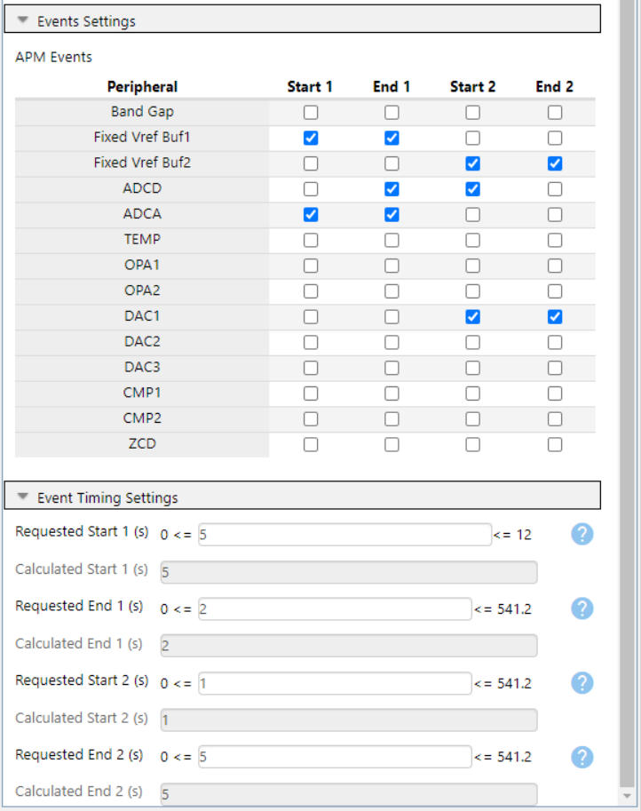
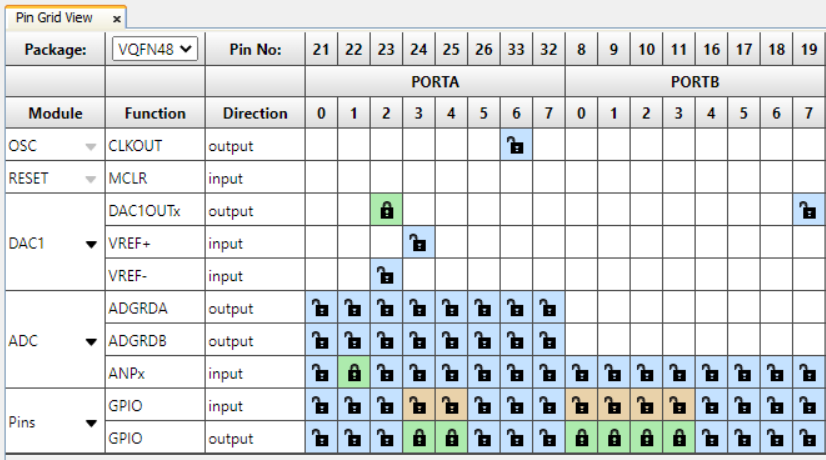
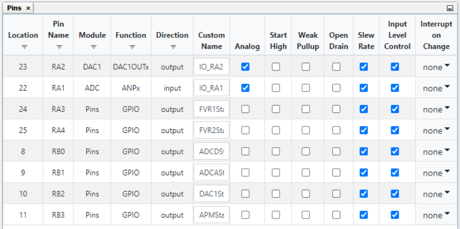

# Analog Peripheral Manager (APM) — Triangle waveform generation with FVR, ADC, DAC and APM using PIC18F56Q71 Microcontroller with MCC Melody

This code example highlights the capabilities of the Analog Peripheral Manager (APM) and its configuration in MCC Melody. The Fixed Voltage Reference (FVR) peripheral provides voltage references of 2.048V and 4.096V to the Analog-to-Digital (ADC) and Digital-to-Analog Converters (DAC) respectively. The DAC peripheral is used to output a triangle waveform with variable amplitude controlled by the value measured by the ADC from a potentiometer. The APM is set as the auto-conversion trigger source for the ADC, and the Timer1 (TMR1) module’s overflow interrupt is used to alter the output of the DAC peripheral. The ADC peripheral’s conversion-complete interrupt is used to modify the amplitude of the triangle waveform. The APM periodically enables the FVR to set the voltage references, the ADC to perform a single conversion, and the DAC to output the triangle waveform.

## Related Documentation

More details and code examples on the PIC18F56Q71 can be found at the following links:

- [PIC18-Q71 Product Family Page](https://www.microchip.com/en-us/products/microcontrollers-and-microprocessors/8-bit-mcus/pic-mcus/pic18-q71)
- [PIC18F56Q71 Code Examples on GitHub](https://github.com/orgs/microchip-pic-avr-examples/repositories?q=pic18f56q71&type=all&language=&sort=)

## Software Used

- [MPLAB® X IDE](http://www.microchip.com/mplab/mplab-x-ide) v6.10 or newer
- [MPLAB® XC8](http://www.microchip.com/mplab/compilers) v2.41 or newer
- [PIC18F-Q Series Device Pack](https://packs.download.microchip.com/) v1.19.401 or newer

## Hardware Used

- The [PIC18F56Q71 Curiosity Nano](https://www.microchip.com/en-us/development-tool/EV01G21A) development board is used as a test platform:
   

- [Curiosity Nano Adapter](https://www.microchip.com/en-us/development-tool/AC164162):
   

- [POT 3 CLICK](https://www.mikroe.com/pot-3-click) board (mikroBUS socket 1):
   
 

## Operation

To program the Curiosity Nano board with this MPLAB® X project, follow the steps provided in the [How to Program the Curiosity Nano Board](#how-to-program-the-curiosity-nano-board) chapter.  

## Setup

The following configurations must be made for this project:

- Clock Control:
  - Clock Source: HFINTOSC
  - HF Internal Clock: 64 MHz
  - Clock Divider: 1

   

- Configuration bits:
  - WDT operating mode: WDT Disabled

   

- Interrupt Manager:
  - Enable Vectored Interrupt: Yes

   

- TMR1:
  - Enable Timer: No
  - 16-Bit Read/Write Mode Enabled: Yes
  - Clock Source: HFINTOSC
  - Prescaler: 1:8
  - Timer Period: 5 ms
  - TMR Interrupt Enable: Yes

   

- FVR:
  - Enable FVR: No
  - FVR buffer 1 Gain (to ADC): 2x 
  - FVR buffer 2 Gain (to DAC): 4x

   

- DAC1:
  - VDD: 5V
  - Required ref: 4.096V
  - DAC Enable: No
  - DAC Positive reference selection: FVR
  - DAC Negative reference selection: VSS
  - DAC Output Enable Selection: DACOUT1 Enabled and DACOUT2 Disabled

   

- ADC:
  - ADC Enable: No
  - Input Configuration: single-ended mode
  - Auto-conversion Trigger Source: Analog Peripheral Module
  - Result Format: right justified
  - VDD: 5V
  - Clock Selection: ADCRC
  - ADI Interrupt: Enabled
  - Context 1 configuration:
    - Positive Channel Selection: ANA1
    - Positive Voltage Reference: FVR
    - Operating Mode Selection: Basic mode
  
   
   

- APM:
  - APM Enable: Yes
  - Clock Source: LFINTOSC
  - Requested Period: 12s
  - APM Events: 
    - Start 1: enable FVR Buffer 1 and ADCA
    - Start 2: enable FVR Buffer 2, ADCD and DAC1
    - End 1: disable FVR Buffer 1, ADCA and ADCD
    - End 2: disable FVR Buffer 2 and DAC1 
  - Requested Start 1: 5s
  - Requested Start 2: 1s
  - Requested End 1: 2s
  - Requested End 2: 5s

   
   

  The configured APM period is 12s. The Start 1 event, which enables the FVR Buffer 1 and the analog part of the ADC peripheral, occurs 5s after the period counter started. The APM is set as the ADC Auto-conversion Trigger Source, therefore the ADCD Peripheral Start bit needs to be enabled for a conversion to be triggered. The Start 2 event, which enables the FVR Buffer 2, the DAC1 and the ADCD peripherals, occurs 1s after the Start 1 event.

| Pin | Configuration  |        Description        |
| :-: | :------------: | :-----------------------: |
| RA1 |  Analog input  |        potentiometer      |
| RA2 |  Analog output |            DAC1           |
| RA3 | Digital output |         FVR1 status       |
| RA4 | Digital output |         FVR2 status       |
| RB0 | Digital output |         ADCD status       |
| RB1 | Digital output |         ADCA status       |
| RB2 | Digital output |         DAC1 status       |
| RA3 | Digital output |   analog modules status   |

 

| Pin |     Label      |
| :-: | :------------: |
| RA3 |   FVR1Status   |
| RA4 |   FVR2Status   |
| RB0 |   ADCDStatus   |
| RB1 |   ADCAStatus   |
| RB2 |   DAC1Status   |
| RA3 |   APMStatus    |

 

## Demo

Board setup:

 

Logic analyzer screen captures:

 
 

## Summary

This code example shows how to configure the APM to enable and disable the FVR, ADC, and DAC peripherals and generate a triangle waveform with variable amplitude.

  
[Back to Top](#analog-peripheral-manager-apm--triangle-waveform-generation-with-fvr-adc-dac-and-apm-using-pic18f56q71-microcontroller-with-mcc-melody)
 

## How to use the variable voltage supply on the Curiosity Nano board

The VOFF pin connected to the Curiosity Nano board is pulled low on Curiosity Nano Adapter. When VOFF is low, the variable voltage power suppy on the Curiosity Nano board is disabled, and 3.3V is supplied from the Curiosity Nano Adapter to the microcontroller.

The FVR peripheral's output cannot exceed VDD, so to obtain a fixed voltage reference of 4.096V some hardware changes must be made to the Curiosity Nano Adapter board.

 

To use the variable voltage power supply on the Curiosity Nano board, remove resistors R11 and R15 from the Curiosity Nano Adapter. For additional information on this subject refer to [Curiosity Nano Base for Click boards™ Hardware User Guide](https://ww1.microchip.com/downloads/en/DeviceDoc/Curiosity-Nano-Base-for-Click-boards-User-Guide-50002839.pdf).

**Note: The above changes are optional for this code example. If not performed, the FVR peripheral's output will be limited to VDD, which is 3.3V by default.**

## How to Program the Curiosity Nano Board

This chapter demonstrates how to use the MPLAB® X IDE to program a PIC® device with an Example_Project.X. This is applicable to other projects.

1.  Connect the board to the PC.

2.  Open the Example_Project.X project in MPLAB® X IDE.

3.  Set the Example_Project.X project as main project.
     Right click the project in the **Projects** tab and click **Set as Main Project**.
     

4.  Clean and build the Example_Project.X project.
     Right click the **Example_Project.X** project and select **Clean and Build**.
     

5.  Select **PICxxxxx Curiosity Nano** in the Connected Hardware Tool section of the project settings:
     Right click the project and click **Properties**.
     Click the arrow under the Connected Hardware Tool.
     Select **PICxxxxx Curiosity Nano** (click the **SN**), click **Apply** and then click **OK**:
     

6.  **Optional - Only required if the variable voltage power supply on the Curiosity Nano board is used.** 
     Right click the project and click **Properties**.
     Click on **PKOB nano** under Categories.
     Click the arrow under Options for PKOB nano.
     Select **Power**:
     
     Check the box next to Power target circuit.
     Double click below the check box and set the Voltage Level to 5V.
     Click **Apply** and then click **OK**:
     

7.  Program the project to the board.
     Right click the project and click **Make and Program Device**.
     

 

- [Back to Setup](#setup)
- [Back to Demo](#demo)
- [Back to Summary](#summary)
- [Back to Top](#analog-peripheral-manager-apm--triangle-waveform-generation-with-fvr-adc-dac-and-apm-using-pic18f56q71-microcontroller-with-mcc-melody)
